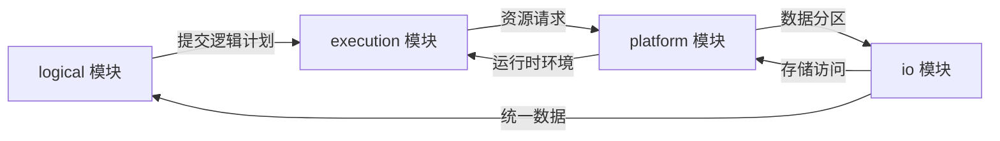
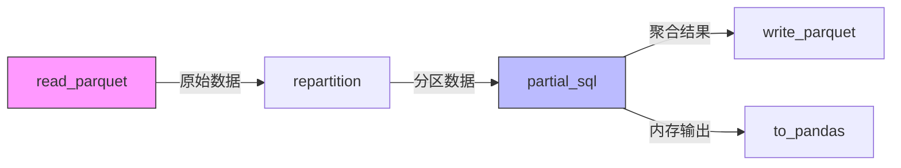
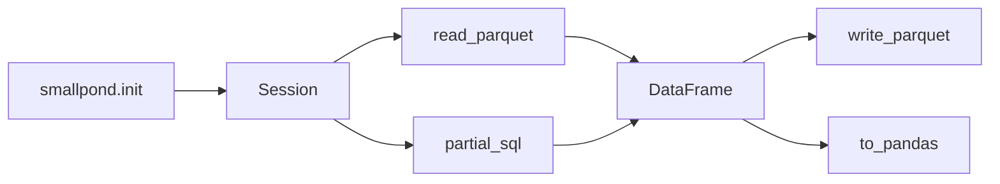

> 这是「DeepSeek 数据基础设施巡礼」系列的第 2 篇。第 1 篇 [《3FS 的零拷贝之路》](post.html?slug=3fs-usrbio-zero-copy) 讲了底层存储是怎么把吞吐推到 6.6 TiB/s 的；这一篇上一层，看 DeepSeek 是如何在这块底座上搭出"会写 SQL"的分布式数据框架。

Smallpond 是一款轻量级的分布式数据处理框架，定位非常明确——为 **AI 和大数据场景下的大规模数据**（通常在 **10 TB 到 PB 级**）服务。它没有去重新造一个执行引擎、也没有自己写存储，而是把三块成熟零件拼到了一起：

- **DuckDB**：列式向量化的 SQL 执行引擎，单核就能跑出可观吞吐
- **3FS**：基于 RDMA + NVMe 的高性能分布式文件系统（也是 DeepSeek 开源的）
- **Ray**：业界成熟的分布式任务调度平台

这种"组装风格"的取舍非常有代表性：拿走的是工程上的复杂度，留下的是一份高度聚焦的代码骨架。下面我从架构分层开始，自顶向下把这套骨架拆给你看。

---

# 一、系统架构

## 1.1 架构分层设计概述

Smallpond 框架采用清晰的四层架构设计，各层通过明确定义的接口进行交互：


把这四层职责和它们各自的"上下游"梳理一下：

### 1) logical 模块

**职责**

- 定义逻辑计划（Logical Plan）并优化查询（`logical_plan/optimizer`）
- 管理用户自定义函数（UDFs）

**交互**

- 通过 `context` 类统一管理逻辑计划
- 向 `execution` 模块输出优化后的逻辑计划

### 2) execution 模块

**职责**

- 将逻辑计划转换为可执行计划（Execution Plan）
- 协调分布式任务的实际执行

**交互**

- 接收 `logical` 模块的优化结果
- 依赖 `platform` 模块分配计算资源

### 3) platform 模块

**职责**

- 提供 MPI / Ray 支持的分布式运行时环境
- 管理 3FS 存储系统等底层资源

**交互**

- 为 `execution` 模块提供资源调度
- 与 `io` 模块协同处理数据分区

### 4) io 模块

**职责**

- 支持 Parquet 等格式的数据加载 / 输出
- 提供统一数据访问接口

**交互**

- 集成 `platform` 模块的存储系统（3FS / DuckDB）
- 为其他模块屏蔽数据格式差异

如果用一张图把模块之间的依赖关系可视化，大概是这样：



### 层级交互规范

| 交互方向 | 接口形式 | 数据流向 |
|:-:|:-:|:-:|
| Logical → Execution | 优化器（Optimizer） | 逻辑计划 → 执行计划 |
| Execution → Platform | 执行计划 | 任务调度指令 |
| Platform → IO | 数据流管道 | 读写操作请求 |

各层严格遵循"下层为上层提供服务"的原则，通过标准化接口降低耦合度。**Platform 层是整套架构里最"重"的一层**——它同时承担着"连接计算框架（Ray / MPI）"和"连接存储系统（3FS）"的双重职责，可以说是整个 smallpond 的运行时枢纽。

简单画一下层次关系：`Logical (优化器) → Execution (执行计划) → Platform (运行时 + 资源) → IO (数据格式)`，上层只依赖下层暴露的接口，互不耦合。

---

## 1.2 端到端工作流示例

### 快速开始（Quick Start）

下面这段示例代码展示了从数据加载到分析输出的完整处理链路。如果你只是想快速验证 smallpond 的能力，跑通这三步基本就够了：

```bash
# 下载示例数据
wget https://duckdb.org/data/prices.parquet
```

```python
import smallpond

# 初始化会话
sp = smallpond.init()

# 数据加载与处理
df = (sp.read_parquet("prices.parquet")
        .repartition(3, hash_by="ticker")
        .partial_sql("SELECT ticker, min(price), max(price) FROM {0} GROUP BY ticker"))

# 结果输出
df.write_parquet("output/")
print(df.to_pandas())
```

四个动作分别落到框架的不同位置：

| 阶段 | 关键操作 | 技术要点 |
|:-:|:-:|:-:|
| 数据加载 | `read_parquet` | 原生支持 Parquet 列式存储 |
| 分布式处理 | `repartition` + `hash_by` | 按 ticker 字段哈希分区 |
| SQL 转换 | `partial_sql` | 支持标准 SQL 聚合函数 |
| 结果输出 | `write_parquet` + `to_pandas` | 双输出模式（文件 / 内存） |

### 数据流依赖图



### 模块基础调用关系



---

## 1.3 两套 API

smallpond 同时提供了 **high-level** 和 **low-level** 两套 API：前者用 DataFrame 链式调用，对老 Pandas / PySpark 用户友好；后者直接操作 Node 和 Plan，更接近编译器/执行器的内核视角。本篇以 high-level 为切入走读它的源码。

### 示例 1 - High-level API

```python
sp = smallpond.init()
df = sp.read_parquet("path/to/dataset/*.parquet")
df.write_parquet("path/to/output")
```

### 示例 2 - Low-level API

```python
driver = Driver()
ctx = Context()
dataset = ParquetDataSet(input_paths)
node = DataSourceNode(ctx, dataset)
node = DataSetPartitionNode(ctx, (node,), npartitions=npartitions)
node = SqlEngineNode(ctx, (node,), "SELECT * FROM {0}")
plan = LogicalPlan(ctx, node)
driver.run(plan)
```

低级 API 的几个核心概念：

- **Driver**：对 JobManager 的封装，负责读取命令行参数并传给 JobManager
- **Scheduler / Executor**：底层 API，调度并执行 task
- **Node**：封装数据处理工作流的最小单位。一个典型的 workflow 写下来就是「创建全局 context → 创建数据集 → 创建数据源 Node → 串接执行引擎 → 组装成 LogicalPlan」

API 详细文档见 [smallpond 官方仓库](https://github.com/deepseek-ai/smallpond/blob/main/docs/source/api.rst)。

---

# 二、绕不开的基础：Parquet 是什么

读 smallpond 之前必须先聊一下 Parquet——因为它的 IO 层本质上是围绕 Parquet 设计的，整套数据流也都遵循 Parquet 的列式语义。

Parquet 是一种**列式存储文件格式**，主要用于大数据处理和分析。它在 OLAP 场景下能跑这么快，靠的是下面四个核心特性。

### 1) 列式存储

在大数据系统里，宽表常常有几百列，但单次查询往往只涉及其中很少几列。列式存储让 Parquet **只读所需的列**，I/O 直接砍掉一大截，查询自然快。

### 2) 高效压缩与编码

同一列的数据天然同质，压缩率非常好。Parquet 支持 Snappy、Gzip、LZO 等多种压缩算法，并叠加 RLE、bit-packing、dictionary encoding 等编码方式。**举个直观的例子**：如果一列只存"男 / 女"，整列就可以被压成一串单 bit 序列，存储成本几乎可以忽略。

### 3) Schema 演进

Parquet 通过允许添加 / 删除 / 修改列而不影响现有数据来支持 schema 演进。这对长生命周期的数据湖至关重要——你不需要每次加一个字段都重写历史。

### 4) 复杂数据类型

Parquet 支持嵌套和重复结构，以及数组、映射（map）、结构（struct）等丰富类型。对 JSON / Protobuf 这类层次化数据来说，可以高效地落进紧凑的二进制格式。

## 2.1 文件布局

理解 Parquet 的布局基本等价于理解它的性能模型，自上而下大致是这样：

```
Parquet File
├── Magic Number "PAR1"
├── Row Group #1
│   ├── Column Chunk: ticker     → Page Page Page ...   (RLE / Dict)
│   ├── Column Chunk: price      → Page Page Page ...   (Snappy)
│   └── Column Chunk: timestamp  → Page Page Page ...   (Delta)
├── Row Group #2
├── ... (一个文件可以有 N 个 Row Group)
└── Footer · Metadata
    ├── schema / 行数 / 创建工具
    ├── 每个 row group / column chunk 的偏移与编码
    ├── zone maps（page 级 min/max/count，做谓词下推）
    └── Bloom Filter（可选，column chunk 级精确判存在）
```

一个完整的 Parquet 文件包含数据和元数据两部分：

- 数据按行被切分为一到多个 **row group**
- 每个 row group 里，每一列存为一个连续的 **column chunk**
- 每个 column chunk 进一步切分为多个 **page**——page 是 Parquet 中的最小数据存储单元，每页带上自身的元数据、实际数据值、以及嵌套层级信息（rep / def levels）

元数据放在**文件末尾的 footer** 里，这样写入时可以顺序追加、读取时只 seek 一次，主要内容包括：

- 文件版本
- schema
- 每个 row group 中每个 column chunk 的位置
- 类型 / 编码方式 / 压缩方式
- **zone maps**（page 粒度的统计指标：min / max / count）
- ……

为了进一步提升查询效率，Parquet 还支持额外的 **Bloom Filter** 结构。Bloom Filter 是一种空间效率很高的概率数据结构，能快速判断某个值"是否一定不存在"。Parquet 为每个 column chunk 维护一份 Bloom Filter，当查询的选取值很少（高选择性）时，系统先查 Bloom Filter 判断这个 column chunk 里到底有没有这个值；如果没有，整段直接跳过，连 page 都不用打开。Footer 里的 zone maps 也起类似的过滤作用。

> **一句话总结 Parquet 的性能模型**：通过 zone maps 和 Bloom Filter 在 footer 阶段就把不必要的 IO 砍掉，再用列式 + 列内编码进一步榨干每一字节的传输价值。这正是 smallpond 能直接吃到 DuckDB 性能红利的前提。

延伸阅读：

- [数据库内核杂谈（三十） - 大数据时代的存储格式 Parquet](https://www.infoq.cn/article/TSp7PGHp8dCbhsDhAxDS)
- [数据库内核杂谈（三十一） - 大数据时代的存储格式 Parquet（2）](https://www.infoq.cn/article/jR8f0ugPCC8L9HR0fYuu)
- [Parquet 官方文档](https://parquet.apache.org/docs/)
- [CMU 15-721 - 02 Data Formats & Encoding I](https://15721.courses.cs.cmu.edu/spring2024/notes/02-data1.pdf)

---

# 三、smallpond 的运行时数据目录

跑起来一个 smallpond job 之后，它会在 `data_root` 下生成一个以 "时间戳.job_id" 命名的目录，所有中间状态、日志、产出都落在这里：

```
data_root
└── 2024-12-11-12-00-28.2cc39990-296f-48a3-8063-78cf6dca460b   # job_time.job_id
    ├── config              # 配置 + 状态快照
    │   ├── exec_plan.pickle
    │   ├── logical_plan.pickle
    │   └── runtime_ctx.pickle
    ├── log                 # 日志
    │   ├── graph.png
    │   └── scheduler.log
    ├── queue               # scheduler 与 worker 之间的消息队列
    ├── output              # 输出数据
    ├── staging             # 中间数据
    │   ├── DataSourceTask.000001
    │   ├── EvenlyDistributedPartitionProducerTask.000002
    │   ├── completed_tasks  # 已完成 task 的输出 dataset
    │   └── started_tasks    # checkpoint 用
    └── temp                # 临时数据
        ├── DataSourceTask.000001
        └── EvenlyDistributedPartitionProducerTask.000002
```

这个目录结构对调试非常友好：当 job 跑挂了，`config/*.pickle` 让你可以离线还原现场；`log/graph.png` 是自动生成的逻辑/物理执行图；`staging/completed_tasks` 让你重启后能从 checkpoint 续跑而不是从零开始。这些都是大数据框架"易于运维"的基本功，smallpond 没有偷懒。

详细约定见官方仓库 [internals.rst](https://github.com/deepseek-ai/smallpond/blob/main/docs/source/internals.rst)。

---

# 四、核心组件

| 组件 | 角色 |
|---|---|
| **查询引擎（DuckDB）** | 列式 + 向量化执行，提供高效 SQL 查询能力 |
| **存储适配层（3FS）** | 集成 3FS，负责数据读写和缓存管理 |
| **任务调度** | 轻量级调度器，支持并行处理和流水线优化 |
| **Ray** | 分布式计算调度平台 |

## 4.1 代码目录结构

简单浏览一下 repo 的 layout，能帮你建立"哪段代码在哪一层"的直觉：

```
smallpond
├── contrib/
├── execution/
│   ├── driver.py           # low-level 调度
│   ├── executor.py         # low-level 调度
│   ├── manager.py          # low-level 调度
│   ├── scheduler.py        # low-level 调度
│   ├── task.py             # 所有 task 节点的基类
│   └── workqueue.py        # 通用工具
├── io/
├── logical/
│   ├── dataset.py          # 通用数据结构
│   ├── node.py             # 所有 logical 节点的基类
│   ├── optimizer.py        # 执行计划优化器
│   ├── planner.py          # low-level planner
│   └── udf.py
├── platform/
├── __init__.py
├── common.py
├── dataframe.py            # 核心结构
├── session.py              # 基础会话，对应 1 个 job
├── utility.py
└── worker.py               # high-level worker 节点启动代码
```

---

# 五、源码走读

我们沿着前面那段 high-level API 一行一行往下追。

## 5.1 初始化 smallpond

```python
import smallpond

sp = smallpond.init()
```

`Session` 的初始化做了三件事：

1. **初始化并连接 Ray 集群**
   - 找不到 Ray 集群时启动一个本地集群
   - 如果通过环境变量 `RAY_ADDRESS` 或 `init` 入参指定了集群地址，则直接连过去
2. **初始化 smallpond 的 data 与 log 路径**（也就是上面提到的 `data_root` 那套目录）
3. **拉起 dump 线程定时打印日志**

细节见 `smallpond/smallpond/session.py`。

## 5.2 设置输入源

```python
df = sp.read_parquet("/path/to/dataset/*.parquet")
```

`read_parquet` 函数定义：

```python
def read_parquet(
    self,
    paths: Union[str, List[str]],
    recursive: bool = False,
    columns: Optional[List[str]] = None,
    union_by_name: bool = False,
) -> DataFrame:
    """
    Create a DataFrame from Parquet files.
    """
    dataset = ParquetDataSet(
        paths, columns=columns, union_by_name=union_by_name, recursive=recursive
    )
    plan = DataSourceNode(self._ctx, dataset)
    return DataFrame(self, plan)
```

这里 `read_parquet` 函数生成了链路上的第一个节点 —— `DataSourceNode`。它的入参是 `ParquetDataSet`，基类是 `DataSet`，同源还有 `CsvDataSet` 等其他派生类。

函数末尾把 `DataSourceNode` 传给 `DataFrame` 构造函数，返回一个 DataFrame。**`DataFrame` 这个类代表一个分布式数据集合，是整套 high-level API 的核心**——它本身不持有数据，只持有一个指向逻辑计划节点的引用。

## 5.3 设置数据分片方式

```python
df = df.repartition(3, hash_by="ticker")
```

`repartition` 函数定义：

```python
if by is not None:
    assert hash_by is None, "cannot specify both by and hash_by"
    plan = ShuffleNode(
        self.session._ctx,
        (self.plan,),
        npartitions,
        data_partition_column=by,
        **kwargs,
    )
elif hash_by is not None:
    hash_columns = [hash_by] if isinstance(hash_by, str) else hash_by
    plan = HashPartitionNode(
        self.session._ctx, (self.plan,), npartitions, hash_columns, **kwargs
    )
else:
    plan = EvenlyDistributedPartitionNode(
        self.session._ctx,
        (self.plan,),
        npartitions,
        partition_by_rows=by_rows,
        **kwargs,
    )
return DataFrame(self.session, plan, recompute=self.need_recompute)
```

smallpond 内置了三种分片方式：

```python
df = df.repartition(10, by_rows=True)    # 按行均匀分布
df = df.repartition(10, hash_by="host")  # 按列哈希分区
df = df.repartition(10, by="bucket")     # 按列值分区
```

它们的基类都是 `PartitionNode(Node)`。注意这里有一个**很关键的设计**：函数定义中把上一步生成的 `DataSourceNode` 节点作为入参（`self.plan`）传入了 `PartitionNode` 的构造函数中，作为新 Node 的 `input_deps`。这相当于是在用"指针"把节点串成一条 DAG，而后续遍历执行计划时正是按照这条 DAG 拓扑序走下去的。

## 5.4 设置 SQL 执行语句

```python
df = sp.partial_sql("SELECT * FROM {0}", df)
```

`partial_sql` 函数定义：

```python
"""
Examples
--------
Join two datasets. You need to make sure the join key is correctly partitioned.

.. code-block::

    a = sp.read_parquet("a/*.parquet").repartition(10, hash_by="id")
    b = sp.read_parquet("b/*.parquet").repartition(10, hash_by="id")
    c = sp.partial_sql("select * from {0} join {1} on a.id = b.id", a, b)
"""

plan = SqlEngineNode(
    self._ctx, tuple(input.plan for input in inputs), query, **kwargs
)
recompute = any(input.need_recompute for input in inputs)
return DataFrame(self, plan, recompute=recompute)
```

同样的套路：生成一个 `SqlEngineNode` 节点并续接到执行计划尾部。注意 `partial_sql` 的注释里有个**重要的隐含约定**——多表 join 时你必须保证 join key 在两侧都按相同方式 hash 分区，否则结果会出错。这是 smallpond"轻量"的代价：它把分区一致性的责任交给了用户，自己不做隐式 reshuffle。

## 5.5 执行计算

```python
df.write_parquet("output/")
```

这一行才是真正"按下回车"的地方。前面所有的 `read_parquet`、`repartition`、`partial_sql` 都只是在拼 DAG，没有真正跑起来。`write_parquet` 触发的代码逻辑路径：

```
write_parquet
└── write_parquet_lazy
    ├── DataSinkNode               # 生成 sink 节点，汇总结果
    └── compute                    # 开始计算
        ├── get_or_create_tasks    # 生成 task 任务链
        │   ├── Optimizer          # 优化 nodes
        │   ├── Planner            # 生成 Planner
        │   └── planner.visit      # 遍历 nodes 生成 task
        │       └── LogicalPlanVisitor[T].visit
        │           ├── visit_data_source_node
        │           ├── visit_data_sink_node
        │           ├── visit_root_node
        │           ├── visit_union_node
        │           ├── ...
        │           └── visit_partition_node    # ↓ 重点剖析这条
        │                ├── 计算 num_producer_tasks
        │                ├── merge_datasets_task = node.create_merge_task
        │                ├── split_dataset_tasks = node.create_split_task
        │                ├── producer_tasks = node.create_producer_task(...)
        │                └── node.create_consumer_task(...)
        └── task.run_on_ray
            └── @ray.remote exec_task   # 交给 Ray 分布式执行 task
```

可以看到，从 `compute()` 进入之后，整条链路是 **Optimizer → Planner → Visitor → Ray** 的标准编译器/执行器套路。Visitor 模式在这里特别合适——每种 Node 类型都有自己的 visit 方法，新增节点不会污染原有逻辑。

`visit_partition_node` 的核心代码：

```python
max_num_producer_tasks = min(
    node.max_num_producer_tasks,
    math.ceil(node.max_card_of_producers_x_consumers / node.npartitions),
)
num_parallel_tasks = (
    2
    * self.runtime_ctx.num_executors
    * math.ceil(self.runtime_ctx.usable_cpu_count / node.cpu_limit)
)
num_producer_tasks = max(1, min(max_num_producer_tasks, num_parallel_tasks))

if len(all_input_deps) < num_producer_tasks:
    merge_datasets_task = node.create_merge_task(
        self.runtime_ctx, all_input_deps, [PartitionInfo()]
    )
    split_dataset_tasks = [
        node.create_split_task(
            self.runtime_ctx,
            [merge_datasets_task],
            [PartitionInfo(partition_idx, num_producer_tasks)],
        )
        for partition_idx in range(num_producer_tasks)
    ]
else:
    split_dataset_tasks = [
        node.create_merge_task(
            self.runtime_ctx,
            tasks,
            [PartitionInfo(partition_idx, num_producer_tasks)],
        )
        for partition_idx, tasks in enumerate(
            split_into_rows(all_input_deps, num_producer_tasks)
        )
    ]

producer_tasks = [
    node.create_producer_task(
        self.runtime_ctx, [split_dataset], split_dataset.partition_infos
    )
    for split_dataset in split_dataset_tasks
]

return [
    node.create_consumer_task(
        self.runtime_ctx,
        producer_tasks,
        [
            PartitionInfo(),
            PartitionInfo(partition_idx, node.npartitions, node.dimension),
        ],
    )
    for partition_idx in range(node.npartitions)
]
```

这段代码不长，但承担的责任很多。我把它拆成三步来看：

1. **决定 producer 并行度**：取 `max_num_producer_tasks` 和 `num_parallel_tasks` 的最小值，前者是 node 自身的硬上限、后者是根据 executor 数量和可用 CPU 算出的"理论并行度"。可以看出 smallpond 在这里做了一个非常实用的取舍——**不让 producer 任务数无脑膨胀，避免小集群被打成"几千个 Ray task"的尴尬**。
2. **根据 input 数量与 producer 数量的关系，决定要 merge 还是 split**：input 太少就先 merge 再 split；input 已经够多就直接按 producer 数量切。
3. **构造 producer-consumer 二段管线**：producer 负责把上游数据按目标分区方式分发出去，consumer 负责按分区索引拉取属于自己的那一份。

整个 Visitor 跑完之后，逻辑计划就被翻译成了一个 Ray task 的 DAG，最后通过 `@ray.remote` 异步发出去执行。

---

# 六、实测观察

跑了一些不同规模的数据之后，有两个值得记下来的小结论：

**结论 1 · 实际并行度受多重因素制约**

虽然你通过 `repartition` 接口指定了分区数和方式，但实际跑起来的并行度还会被「输入源数量 / CPU 核数 / 配置的最大并行参数」三者联合约束。另外，即使在计算过程中做了分片处理，Ray 调度时还是优先在本节点执行；只有当本节点压力比较大时，task 才会跨机调度。这一行为对中等规模的数据非常友好——避免了很多无意义的网络传输。

**结论 2 · "文件级切片 + task 级并行"的混合粒度**

smallpond 的任务切片粒度是按文件来的，但分布式调度的并行单位是 task。也就是说**它的并行性来自逻辑 task 的并行**，而不是来自把单个文件再切碎。这意味着：当你有很多小文件时 smallpond 自然能跑满，但单个超大文件不会自动被拆——你得自己提前 split 或者用 `repartition` 触发 reshuffle。

---

# 七、使用场景

| 应用场景 | 核心需求 / 痛点 | Smallpond 的解决方案 / 优势 |
|:-:|:-:|:-:|
| **AI 数据预处理** | 海量训练数据（文本、图像等）的清洗、转换、加载 | 高效分布式处理，与 3FS / WFS 结合实现高吞吐数据加载 |
| **大规模数据分析** | 快速分析 PB 级结构化 / 半结构化数据 | DuckDB 列式 + 向量化执行 + 并行计算 |
| **高性能数据排序** | 对超大规模数据集（如 100 TB+）排序 | 在 GraySort 基准里跑出 **3.66 TiB/min** |
| **金融数据分析** | 行情聚合、风险分析、高频交易处理 | 按 ticker 哈希分区，并行计算极值 |
| **日志处理与分析** | 分布式系统日志的快速分析 | 并行处理服务器日志，近实时洞察 |

## 7.1 注意事项与局限性

smallpond 在上面这些场景里表现优异，但它**不是银弹**。下面几种情况下，它可能并不是最佳选择：

- **小规模数据（< 10 TB）**：单机 DuckDB 或其它单机工具往往更简单、更快
- **复杂多表 JOIN**：跨分区连接的优化能力相对有限，复杂多表场景下 Spark 更成熟
- **需要高并发点查**：smallpond 是为批量分析设计的，不适合高并发随机点查
- **部署复杂度**：要充分发挥它的性能（尤其是和 3FS / RDMA 网络结合时），需要相对特定的硬件和环境

---

# 八、写在最后

smallpond 给我的整体观感是：它**坚定地选了"轻量"这条路**。不发明新的 SQL 引擎、不发明新的存储、不发明新的调度器，而是把 DuckDB 在向量化执行上的成熟、3FS 在带宽上的极致、Ray 在分布式调度上的工程化 —— 三块拼到一起，做成一份只有几千行的 Python 框架。

这种风格对真实的工程团队启发很大：**架构师的重要工作之一不是"造轮子"，而是"挑零件 + 划清边界"**。每一层只做自己最擅长的事，下层为上层提供服务，上层不越界干预下层——这样的系统才能跑得快、调得动、撑得久。

下一篇我会再上一层，聊聊把 3FS 和 smallpond 这套底座放到 AI 训练 Pipeline 里之后，整条数据链路是怎么设计的。

---

## 参考资料

- [smallpond GitHub](https://github.com/deepseek-ai/smallpond)
- [smallpond API 文档](https://github.com/deepseek-ai/smallpond/blob/main/docs/source/api.rst)
- [smallpond Internals](https://github.com/deepseek-ai/smallpond/blob/main/docs/source/internals.rst)
- [3FS 的零拷贝之路](post.html?slug=3fs-usrbio-zero-copy) · 本系列上一篇
