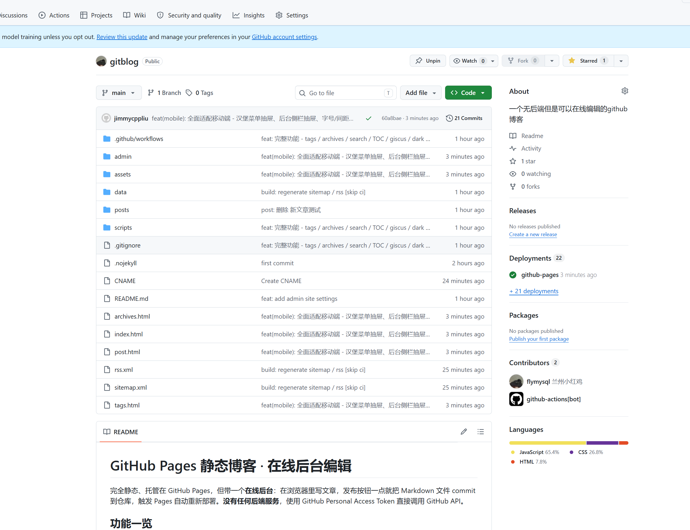

# 欢迎来到我的博客




这是一个**完全静态**、托管在 GitHub Pages 的博客，但是带有一个**可在线编辑的伪后台**。
你不需要把文章写在本地再 `git push` —— 直接在浏览器里点一下"发布"，文章就以 commit 的形式推到了仓库。

## 它是怎么做到的

整个项目只有两件事：

1. **前端**：纯 HTML / CSS / JS，托管在 GitHub Pages
2. **OAuth 中转**：一个非常轻量的 Cloudflare Worker，只用来把 GitHub 返回的 `code` 换成 `access_token`

读者访问博客时，浏览器拉的就是仓库里的 Markdown 文件 —— 没有任何后端。
作者点开 `/admin/` 时，会跳到 GitHub OAuth 授权页，登录后浏览器拿到 token，
之后写文章发布都直接走 GitHub Contents API：

```
PUT /repos/{owner}/{repo}/contents/posts/xxx.md
{
  "message": "post: 新文章",
  "content": "<base64 markdown>",
  "branch": "main"
}
```

GitHub 收到请求 → 仓库多一次 commit → GitHub Pages 重新构建 → 几十秒后线上就更新了。

## 想做的事

- [x] 简书风格 UI
- [x] 文章列表 / 阅读页
- [x] GitHub OAuth 登录
- [x] 在线 Markdown 编辑器
- [x] 自动维护 `data/posts.json` 索引
- [ ] 评论（可考虑接 giscus / utterances）
- [ ] 全文搜索（可考虑离线索引）

> 用一个简书风格的静态博客记录想法，写完一点点就发布一点点，仪式感和便利性兼顾。

祝写作愉快。
