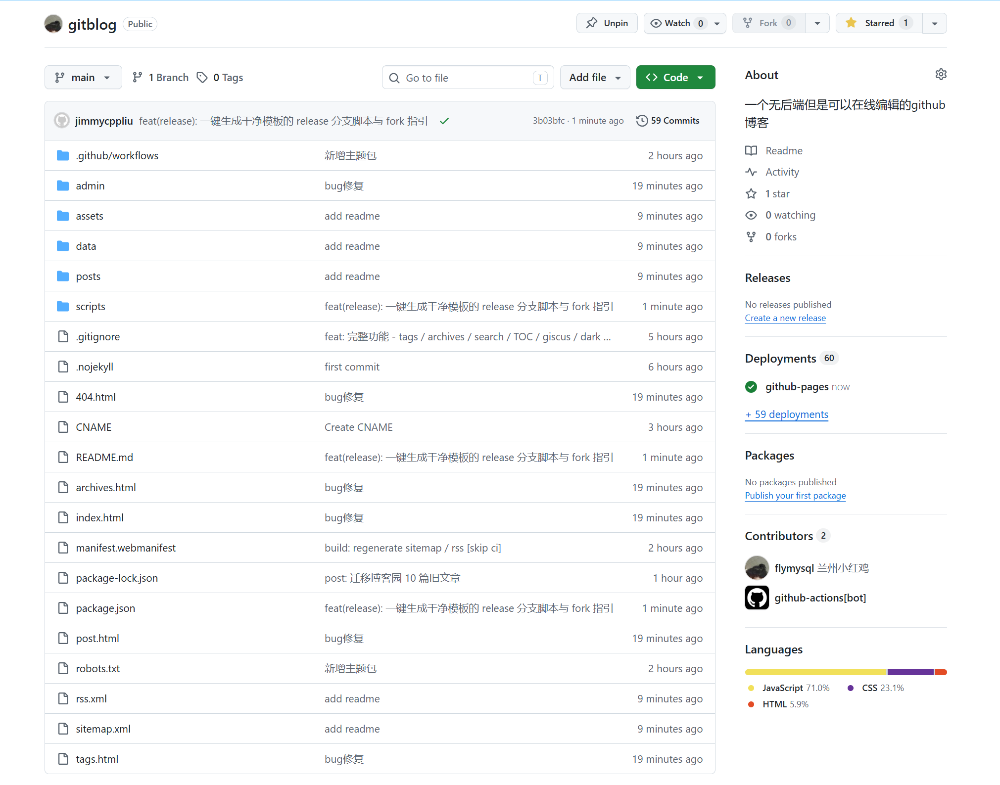

如果把"写博客"这件事抽象一下，无非三步：**写一篇 → 发到网上 → 有人来读**。

围绕这三步，主流方案大体分两条路：

- **静态站点生成器**（Hexo / Hugo / Jekyll / Astro 等）：本地写、本地构建、push 到仓库。便宜稳定快，但每次发文章都要切回终端，发图、build、commit、push，写一篇短文都得绕一圈。
- **有后端的博客系统**（WordPress / Ghost / Typecho 等）：自带在线后台，浏览器里点几下就发文。但要自己买服务器、装数据库、定期更新、做备份、还得防着哪天被扫到漏洞。

这个站点想做的，是把**两条路的好处合在一起**：

> 部署轻得像静态站——托管在 GitHub Pages，**没有任何服务器、没有任何数据库**；
> 写作顺得像有后台的 CMS——浏览器打开就能写、能上传图、能发，**不用再开终端**。

实现思路也很直接：**前端 = 站点 + 写作器**，所有"后端动作"都通过 GitHub 自家的 REST API 完成。每发一篇文章，本质上是给仓库提交一个 commit，触发 Pages 重新部署，几十秒后线上就更新了。

---

## 这个站点都能做什么

### 读者侧

- **简书风的内容流**：Hero / 文章列表 / 标签云 / 最近更新 / 首页轮播
- **文章阅读体验**：自动 TOC 目录、阅读进度条、回到顶部、代码一键复制、标题悬停锚点、图片灯箱、上一篇 / 下一篇、相关文章推荐
- **导航与检索**：标签聚合页（彩色标签）、按年月归档、站内搜索（顶部按钮 / `Ctrl + K` / `/`）
- **主题系统**：浅色 / 深色 / 跟随系统三态切换，4 套主题预设可一键切换（简书 / GitHub / Solarized / Monokai），允许读者自己挑
- **评论**：基于 [giscus](https://giscus.app)（GitHub Discussions），每篇文章按 slug 独立绑定一条 Discussion
- **SEO 与分享**：自动 RSS、sitemap、Open Graph / Twitter Card meta、JSON-LD 结构化数据、自动生成 OG 分享图（SVG）
- **性能**：图片真懒加载（IntersectionObserver，进入视口前 300px 才注入 src）、首屏 LCP 优化、缓存版本号控制、移动端排版做过细化

### 写作侧（伪后台）

- **浏览器里写**：EasyMDE 编辑器，工具栏、快捷键、实时预览
- **图片直接拖**：拖拽 / 粘贴上传，自动归档到 `assets/uploads/yyyy/mm/`，并写入 Markdown 链接
- **`Ctrl + S` 一键发布**：发布前自动校验标题 / 摘要 / 标签 / slug，避免提交坏稿
- **草稿 / 置顶 / 独立页面**：`draft: true` 不进首页，`pinned: true` 在首页置顶，`page: true` 是关于页 / 友链页这种独立页面
- **管理后台**：文章列表（全部 / 已发布 / 草稿三 tab）、图片库、可视化的站点设置（`config.js` 里所有字段都能在线编辑，包括导航、社交链接、giscus、主题色板、自定义 CSS）
- **诊断**：一键诊断页可检查 token、仓库、写权限、分支、索引文件、Pages 状态——出问题立刻能定位

### 自动化

- **GitHub Actions** 自动重建 `data/posts.json` / `sitemap.xml` / `rss.xml` / OG 图，并校验 frontmatter
- **迁移脚本** 把老博客文章一键搬过来：cnblogs、Hexo、公众号文章，自带图片下载、HTML→Markdown、智能取封面、标签归一化、垃圾文案剥离

---

## 与"传统静态站"和"有后端博客"对比

|              | 传统静态博客 (Hexo / Hugo / Jekyll) | **本博客（GitHub Pages + 伪后台）** | 有后端博客（WordPress / Ghost） |
| ------------ | -------------------------- | ----------------------------- | ------------------------ |
| 服务器          | 不需要                        | **不需要**                       | 需要 + 数据库                 |
| 写文章流程        | 本地写 → build → push         | **浏览器里写、点发布**                 | 后台写、点发布                  |
| 上传图片         | 本地放到目录 → push              | **拖进编辑器自动上传**                 | 后台上传                     |
| 发文章成本        | 中（要回到终端）                   | **极低**                        | 低                        |
| 维护成本         | 低                          | **极低**                        | 中（需更新 / 备份 / 防扫）         |
| 数据所有权        | 仓库即数据                      | **仓库即数据，纯 Markdown**          | 数据库表，迁移成本高               |
| 备份           | 仓库即备份                      | **每篇文章 = 一次 commit，git 即历史**  | 需手动备份数据库                 |
| 评论           | 需挂第三方                      | giscus（GitHub Discussions）    | 内置                       |
| 速度           | 很快（CDN 静态）                 | **很快（CDN 静态）**                | 取决于服务器与缓存                |
| 离线读 / 跨平台迁移  | Markdown 文件可直接读            | **Markdown 文件可直接读**           | 数据库内不易导出                 |

简单说：**部署成本对齐传统静态站，写作体验对齐有后端的 CMS，数据所有权完全在自己手里**。所有内容都是 `posts/` 目录下的纯文本 Markdown，哪天想搬走、想换工具、想做全文索引，复制一下目录就行。

---

## 如果你也想搭一个

你只需要两样东西：**一个 GitHub 帐号 + 一个 Personal Access Token (PAT)**。五步跑起来。

### 1. Fork 仓库

仓库地址：[flymysql/gitblog](https://github.com/flymysql/gitblog)。Fork 一份到自己名下。

### 2. 启用 GitHub Pages

仓库 → Settings → Pages → Source 选 `Deploy from a branch`，分支 `main`，目录 `/`，保存。等几十秒，第一版站点就上线了。

### 3. 改 `assets/js/config.js`

把 `repo.owner` / `repo.name` / `repo.branch` 改成你的，把 `site.url` 改成你的 Pages 地址（**末尾不要加 `/`**），其他先不动。这一步是为了让 SEO meta、sitemap、OG 图等用到你自己的域名。

> 其实只要先改这一步推上去，**之后所有配置都可以在 `/admin/settings.html` 里在线编辑**，再也不用回到本地。

### 4. 生成一个 Fine-grained PAT

打开 [GitHub Token 创建页](https://github.com/settings/personal-access-tokens/new)：

- **Repository access**：选 `Only select repositories`，勾选你的博客仓库
- **Repository permissions** → `Contents` 选 `Read and write`，其他保持默认
- 设置一个合适的过期时间，复制 token

### 5. 进后台开始写

访问 `https://<你的用户名>.github.io/<仓库名>/admin/`，把 token 粘进去，登录。之后所有写作 / 上传 / 站点设置 / 主题切换都在浏览器里完成。

每次"发布"，本质上是给仓库提交一次 commit，几十秒后 GitHub Pages 重新部署，文章就上线了。

---

### （可选）开评论

仓库里启用 Discussions → 去 [giscus.app](https://giscus.app) 拿到 `repoId / categoryId` → 进 `admin/settings.html` 把 giscus 字段填上保存即可。

> ⚠ **`mapping` 推荐选 `specific`** —— 每篇文章按 slug 独立绑定一条 Discussion。
> 不要选 `pathname` / `url`，因为本站所有文章 URL 路径都是 `/post.html`（只有 query 不同，giscus 不读 query），那两种模式会让所有文章共用同一条评论流。

### 出问题怎么办

进 `admin/diagnose.html`。这个一键诊断页会按顺序帮你检查：token 是否有效 → 仓库是否可访问 → 分支是否存在 → Contents 写权限 → `posts.json` 索引文件 → Pages 部署状态。任何环节出问题，它会直接告诉你哪一步失败、为什么、怎么修。

---

## 一些小信仰

- **数据是自己的**。所有内容都是仓库里的纯文本 Markdown，搬走 / 备份 / 全文索引 / 重新换工具，都只是 `cp` 一下的事。
- **运维越少越好**。能让 GitHub 帮你做的事，就不要自己买服务器去做。
- **给写作开一条捷径**。最常做的事（写、改、上图、发）都在浏览器里点一下完成，不用再切到终端。

如果你也认同这几条，欢迎 fork 一份，开始写你的第一篇。

祝写作愉快。
